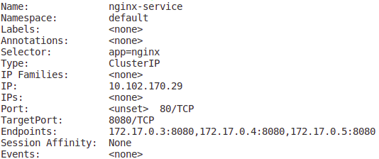
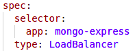
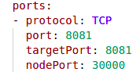
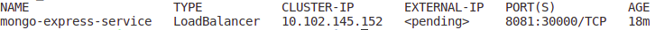
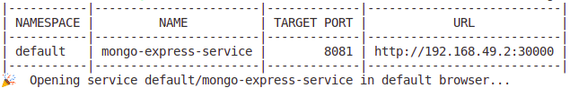
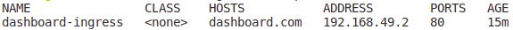
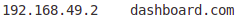
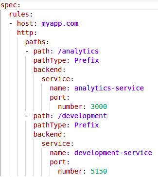
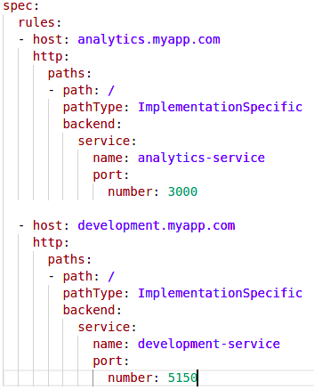
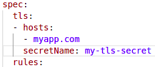

# A Mini Minikube Project

&nbsp;&nbsp;

## Requirements
* Docker installed
* kubectl
* minikube

## Starting a cluster

After requirement instalation, we start a minikube cluster by typing

`minikube start --vm-driver=docker --kubernetes-version=v1.19.0`

It going to pulling base image from minikube with **kubelet**, **kubectl** and **kubeadm** installed. Also with a default namespace. 

`minikube status` 

to open dashboard (only in minikube) 
`minikube dashboard` 

 

By now we have access to kubectl and all resources that he provide, 

`kubectl get nodes` 

`kubectl namespaces` 

 

## Main Kubectl Commands

`kubectl get service` 

`kubectl describe service [service name]` 

Creating a deployment:

`kubectl create deployment nginx-deploy --image nginx:latest --replicas=3 --port=80` 
or 
`kubectl apply -f deployments/nginx.yml` 

`kubectl get deployments` 

`kubectl get pods` 
`kubectl get pods --namespace default` 

`kubectl get replicaset` 

`kubectl delete deployment nginx-deploy` 

Debug commands: 
`kubectl describe pod [pod name]` 

`kubectl logs [pod name]` 

Get inside pod: 
`kubectl exec -it [pod name] -- /bin/bash` 

 

## MongoDB & Mongo Express services

Creating deployment and service for MongoDB: 
`kubectl apply -f mongodb/mongo.yml` 

Creating deployment and service for MongoExpress: 
`kubectl apply -f mongodb/mongo-express.yml` 

Mongo Express needs to be a **external services**. We can define the type in service yaml file, for external services we put LoadBalancer. 

Reminder: *Internal services acts as Load Balancer too*

We also should create a **external ip address** and so accepts external requests. For external address we define as **nodePort** in services yaml file. It must be between **30000 and 32767** 

As result, the services has now a LoadBalancer type and a external ip address signed:  

But since we are working with minikube, status of EXTERNAL-IP is always pending. To fix that we should call:

`minikube service [service-name]` 

This command basically assign a external ip address to our service, making it accessible.

When we send a request to Mongo Express, the External Service communicate with Mongo Express Pod, that communicate with MongoDB Internal Service, and finally he communicate with MongoDB Pod to apply request changes to MongoDB itself

Finally we have setup a simple application using Kubernetes 😁

 

## Ingress

Using minikube, we have to enable K8s Nginx ingress controller by typing `minikube addons enable ingress`

After that, a namespace called **ingress-nginx** is created, containing ingress controller pods, services, deployment and replicaset.

We are going to create a ingress rule to access kubernetes dashboard using a yaml file already configured (*dashbaord-ingress.yml*)  
`kubectl apply -f dashboard-ingress.yml`

After that:

`kubectl get ingress dashboard-ingress -n kubernetes-dashboard`

Then it will show host, ip address and port of our ingress

Now we have to add this ip address to /etc/hosts file:

Then typing dashboard.com in web browser should open kubernetes dashboard

### Multiple rules

You could also get multiple rules in the same host as shown below

In this example, we have a same host **myapp.com** but with 2 paths configured **/analytics** and **/development**. Accessing myapp.com/analytics will send requests to *analytics-services* and the service will call analytics Pod, same happens with development rule. That's a method to have multiple rules in the same host, requesting multiple services/pods

### Sub-domains

Sub-domains are a valid method to request multiples services in kubernetes too.

Instead having 1 host (*myapp.com*) and multiple paths (*myapp.com/analytics* and *myapp.com/development*) now we have **multiple hosts** (*analytics.myapp.com* and *development.myapp.com*) when each host represents a sub-domain

### Certification

To configure a TLS certification, we must create a secret contaning certification and key, both base64 encoded (*tls-certification-secret.yml example*). In ingress yaml file, there's a tls option where we setup the secret name defined before in secret file

1. secretName key is the same that metadata.name secret file
2. data keys need to be "**tls.crt**" and "**tls.key**"
3. values from crt and key should be their **contents**, not paths
4. secret component must be in the **same namespace** as the ingress component 

These four lines in ingress file are all we have to do to setup a TLS certification 