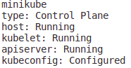
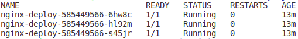
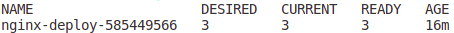

# A Mini Minikube Project

&nbsp;&nbsp;

## Requirements
* Docker installed
* kubectl
* minikube

## Starting a cluster

After requirement instalation, we start a minikube cluster by typing

`minikube start --vm-driver=docker --kubernetes-version=v1.19.0`

It going to pulling base image from minikube with **kubelet**, **kubectl** and **kubeadm** installed. Also with a default namespace. 

`minikube status` 

 
 

By now we have access to kubectl and all resources that he provide, 

`kubectl get nodes` 

`kubectl namespaces` 

 
 

## Main Kubectl Commands

`kubectl get service` 

 

Creating a deployment:

`kubectl create deployment nginx-deploy --image nginx:latest --replicas=3 --port=80` 
or 
`kubectl apply -f deployments/nginx.yml` 

`kubectl get deployments` 

`kubectl get pods` 
`kubectl get pods --namespace default` 

`kubectl get replicaset` 

 

Debug commands:

`kubectl describe pod [pod name]` 

`kubectl logs [pod name]` 

Get inside pod:

`kubectl exec -it [pod name] -- /bin/bash` 

 

`kubectl delete deployment nginx-deploy` 

